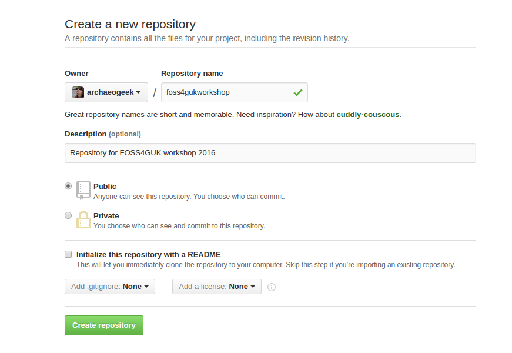
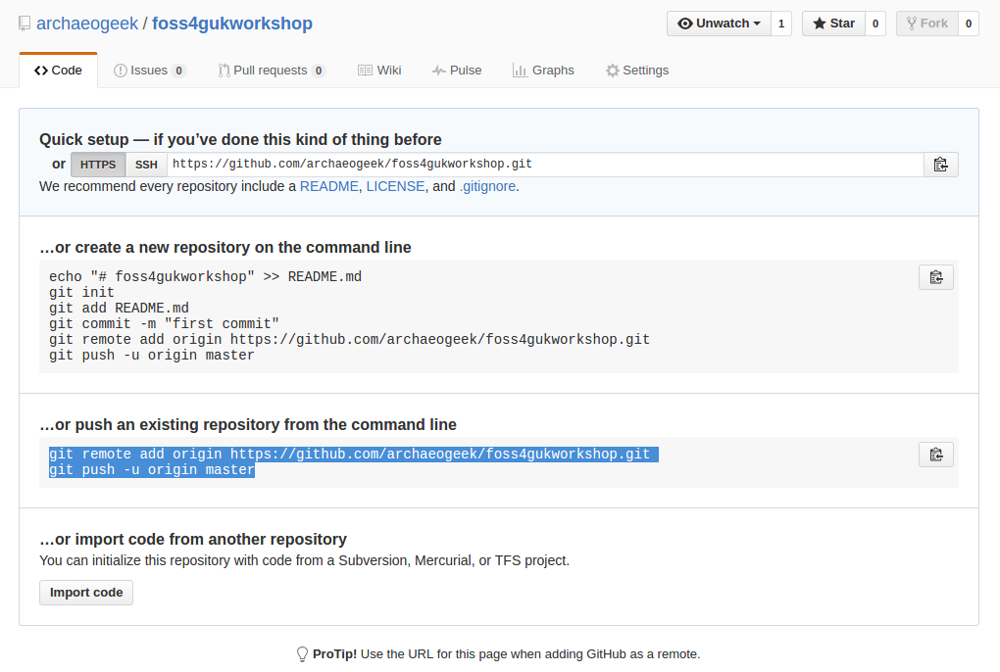

# Working with remote repositories

So now we know how to work with repositories on our local file system. How do we host our repository on GitHub?

Online versions of repositories are generally known as **remotes**, and the process of uploading code to a remote is known as a **push**.

The basic workflow is:

 * Create a new repository for your code on GitHub
 * Add this as a remote for your local repository
 * Make changes to your local repository as usual
 * Upload or push your changes to the remote

##Creating a repository on GitHub##

First of all, you need to create an account on GitHub and sign in at [github.com](http://github.com).

The current GitHub sign in page looks like this:

**Tip: Enable two-factor authentication for better security**

If you're comfortable with SSH then add your SSH key to your account profile for secure committing without your password. For the purposes of this tutorial we will use https instead.

Go to the repository tab on your home page and click the green "New" button.

Give your repository a useful name and description. You'll need to leave it as a public repository (private repositories are currently only available with a paid-for plan). For the purposes of this workshop, leave the option to initialise the repository with a README unticked, and don't select a .gitignore file or license. Then click the big green "Create Repository" button. 

The final stage provides you with the command line instructions you need for adding the GitHub repository as a remote for your local copy. 

*Note the option to switch between ssh and https, and how this changes the address for the repository. Stick with https for now*

We'll add this repository as a remote for the repository we created earlier, so follow the instructions in the second box, titled "... or push an existing repository from the command line".

In our repository folder that we created earlier, type the following commands, substituting your GitHub username and the repository name into the appropriate places:

	git remote add origin https://github.com/<yourusename>/<yourreponame>.git
	git push -u origin master

*The term "master" refers to the default or master branch in the repository. Branches are effectively self-contained copies of the files in the project that can be merged together when required. They are often used for development and stable versions of source code. We'll discuss them briefly later but see the [documentation](https://git-scm.com/book/en/v2/Git-Branching-Branches-in-a-Nutshell) for more detail.*

Go back to [Creating your first local repository](repository.html) and practice making some more changes to your local repository, then use **git push** to push them to the remote repository. Now you might see the value of good commit messages, as these are fully visible in your repository!

*Note that once you have set the master branch you don't need to use the full "-u origin master" statement. Just "git push" will do*

