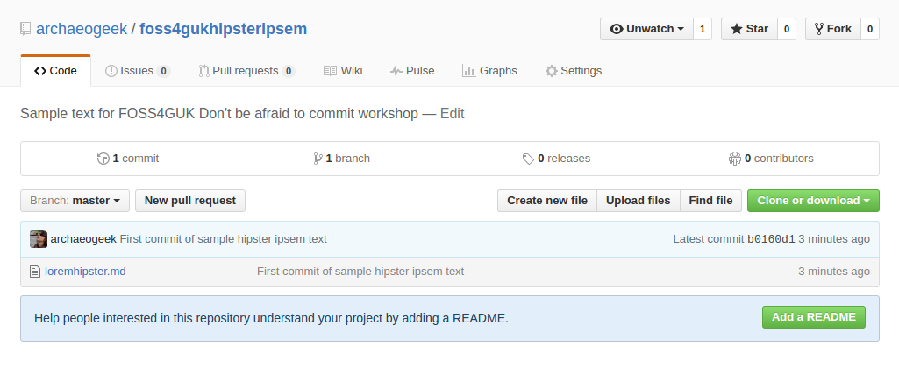

# How to submit a pull request

If you wish to make more complex changes to the code in a remote repository then you need to go through the full process of submitting a pull request. To recap the workflow is:

 * Fork the remote repository using your GitHub account
 * Clone your copy of the repository to your local computer
 * Create a new branch to work on your changes
 * Make your changes locally, commit and push the changes to your remote copy of the repository
 * Tell the original repository owner about your changes, or make a pull request
 * if there are no conflicts with the original code, get your changes merged, or your pull request accepted

**For simplicity's sake, if you have already cloned hipsteripsem to your local computer, delete the local copy, fork it if necessary and re-clone locally to ensure the local copy is up to date. In real life, you'd need to check for changes to your local copy, ensure they were pushed to your fork on GitHub, and then rectify those changes with fresh ones from the original repository.**

## Forking and cloning hipsteripsem

Visit [github.com/archaeogeek/foss4gukhipsteripsem](https://github.com/archaeogeek/foss4gukhipsteripsem) and click the "fork" button to make a copy of the repository under your own GitHub account.

Navigate to your copy of the repository and click the green "Clone or download" button. Click the clipboard next to the https clone URL to copy it.

At your command prompt, change to your top level git repositories directory (that we created at the start of [Creating your first local repository](repository.html)). Type the following:

	git clone <the pasted URL>

Hit return, and this should clone your copy of the hipsteripsem repository to your local machine, in a folder called `foss4gukhipsteripsem`. 

## Making changes locally

Since it's possible that multiple people could be making changes to the original repository, it's important that your changes are isolated from the main or **master** branch. This allows the maintainers to keep track of changes, whilst allowing simultaneous development.

At your command prompt, change directory to the root of your new repository and type the following to create a new branch and switch directly to working on it:

	git checkout -b <newbranchname>

*Note that it's good practice to create a branch for each specific feature or fix that you work on. It should also be concise, and clearly named.*

Make your change, commit it (adding a clear and concise commit message) and push it to your local copy of the repository on GitHub. You will need to set the origin for your new branch the first time you push it up, so use the following code:

	git push -u origin <newbranchname>

**Again, to avoid confusion in this workshop, only make changes to the file with the number you were allocated, otherwise your request may be rejected!**

##Making changes on GitHub

Navigate to the original GitHub repository, and you should see a big green button marked "Compare and pull request". 

Click that button and you will be taken to a page giving you the opportunity to describe your pull request and showing you the changes you have made.

Write a clear and concise subject and description for your change- as the owner of the repository will use this to decide whether to accept your change. Review your changes and when you are happy click the green "Create pull request button".

The next page checks whether there are any conflicts with the base branch. You are given one final chance to comment on the pull request but note this is a comment to the owner and not part of the request itself.

If the owner of the repository is happy with the change then they will merge it with the base branch. If they are not happy they may write a comment back to you asking you for further information or changes.

##Housekeeping

###Keeping your remote repository up to date

After a while, your fork of the remote repository will no longer be up to date, and you will need to make pull requests in the other direction to merge the remote changes into your fork. 

Always ensure that your GitHub repository is up to date with any changes you've made locally before you do this.

###Dealing with conflicts

GitHub will attempt to merge changes in files if it can do so automatically. In the event that it can't, it will provide you with details on how to do this yourself at the command line.

If you open the conflicted file in a text editor it will show you the conflicts using special notifiers, like so:

	This line is unchanged but
	<<<<<<<<<<<<<<<<<HEAD
	Jo edited this line
	===================
	Pete edited this line
	>>>>>>>>>>>>>>>>>MASTER

You can manually remove the notifier lines and the incorrect line, then stage and commit your changes in the normal way.

