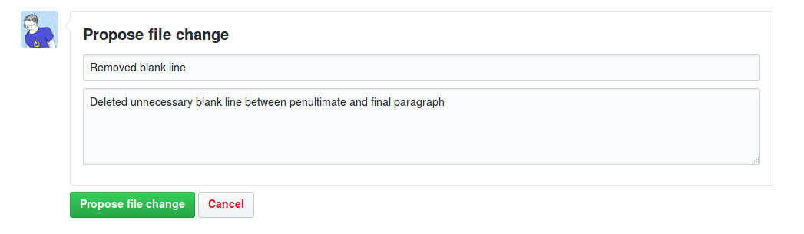

# Making simple fixes to someone else's repository

Generally speaking the approach for contributing to someone else's repository on GitHub is as follows:

 * Fork the remote repository using your GitHub account
 * Clone your copy of the repository to your local computer
 * Create a new branch to work on your changes (we'll cover this later)
 * Make your changes locally, commit and push the changes to your remote copy of the repository
 * Tell the original repository owner about your changes, or make a pull request
 * if there are no conflicts with the original code, get your changes merged, or your pull request accepted

Luckily for simple text-based files, there's an easier approach!

Go to the following repository on GitHub:

[https://github.com/archaeogeek/foss4gukhipsteripsem](https://github.com/archaeogeek/foss4gukhipsteripsem)

Click on the file `loremhipster.md<number>`, where &lt;number&gt; is the number on the card you were given, and then click the pencil symbol to edit it.

**Don't be tempted to choose a different number to the one you were given, as your request may be rejected!**

This will open up the file in a text editor. Make any changes you wish, and ensure you click the "preview changes" button.

Once you're happy with the changes, in the **Propose file change** section below the text editor, add a title and a reason for the commit. 

Finally, when you're happy, click the green "Propose file change" button.

Proposing the file change will take you to a Pull Request review window where you can check your changes against the original file. If it all looks good, then click the green "Create pull request" button. 

This will give you one further chance to change your commit message, then hit the final "Create pull request" button and your pull request will be submitted.

The next page checks whether there are any conflicts with the base branch. You are given one final chance to comment on the pull request but note this is a comment to the owner and not part of the request itself.

If the owner of the repository is happy with the change then they will merge it with the base branch. If they are not happy they may write a comment back to you asking you for further information or changes.

